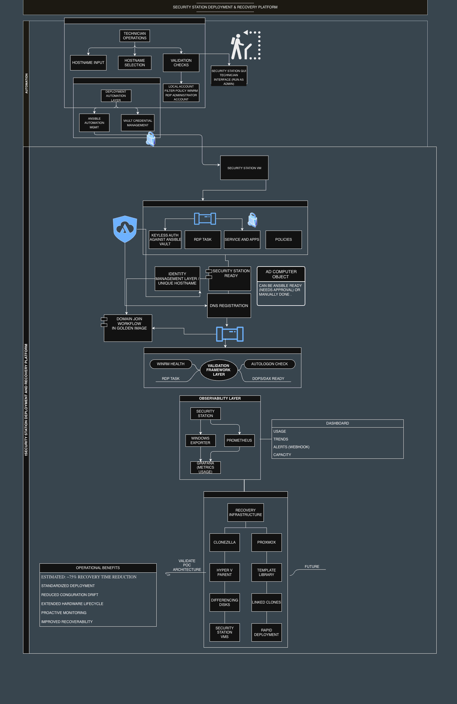
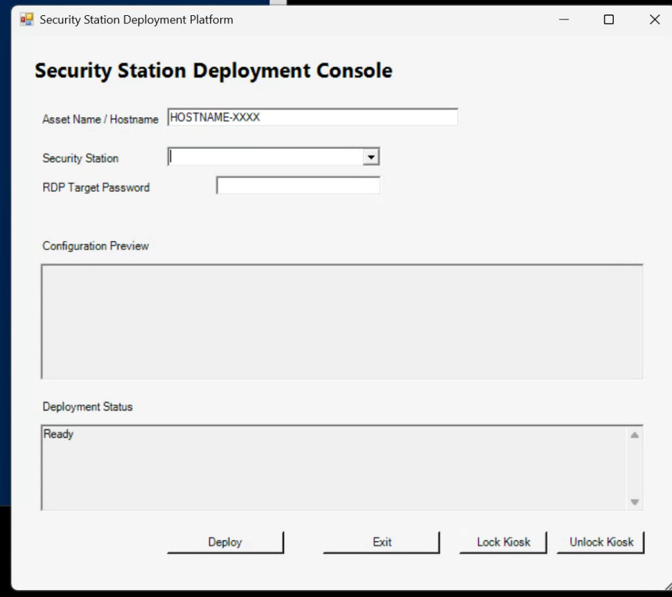
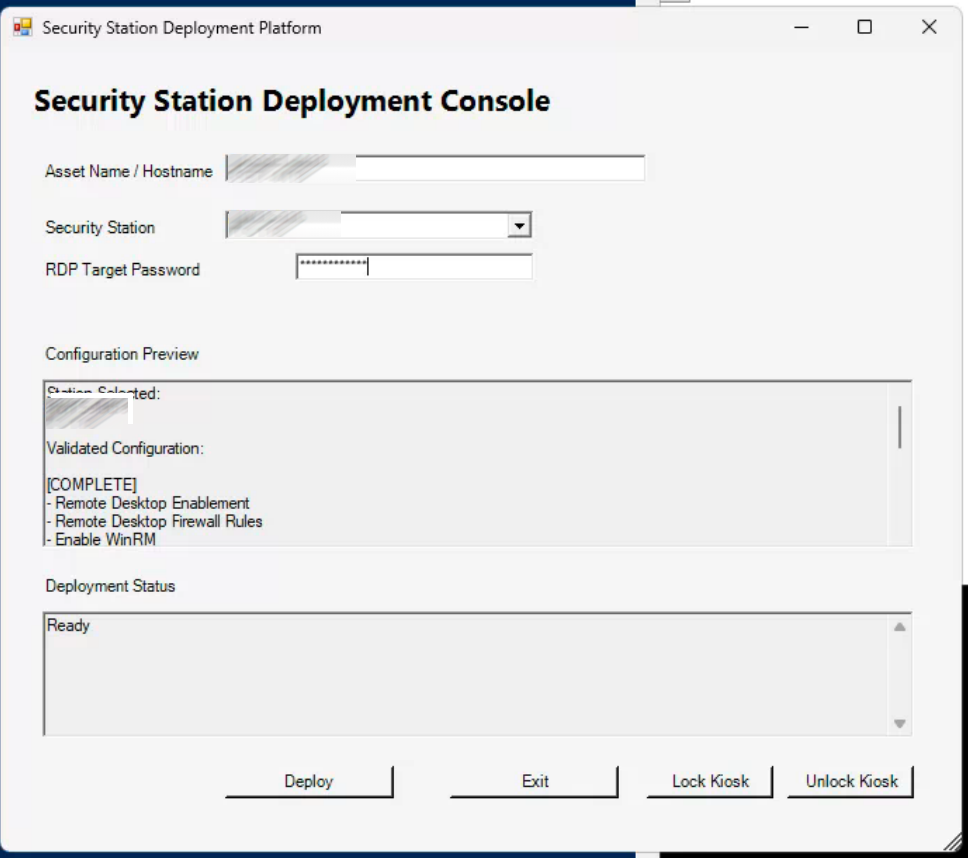
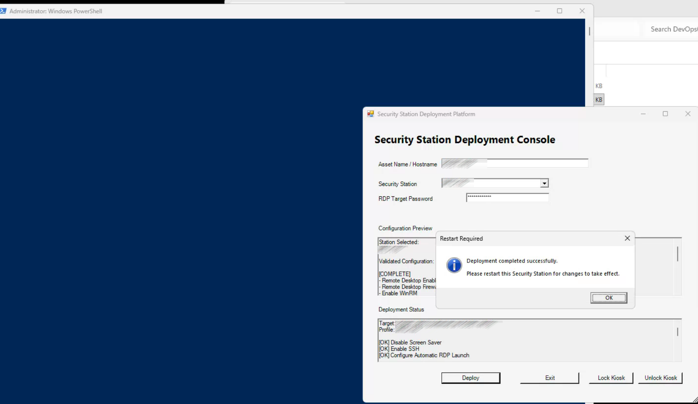
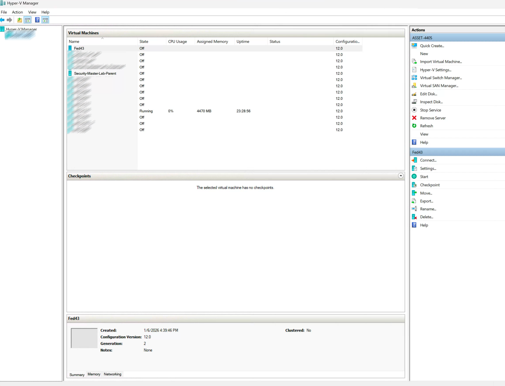
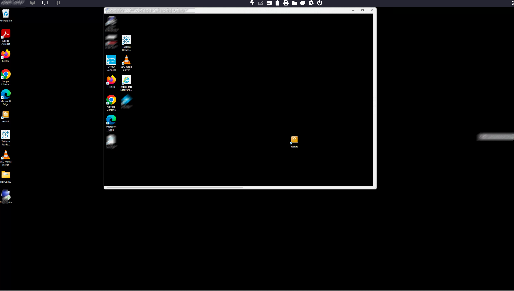
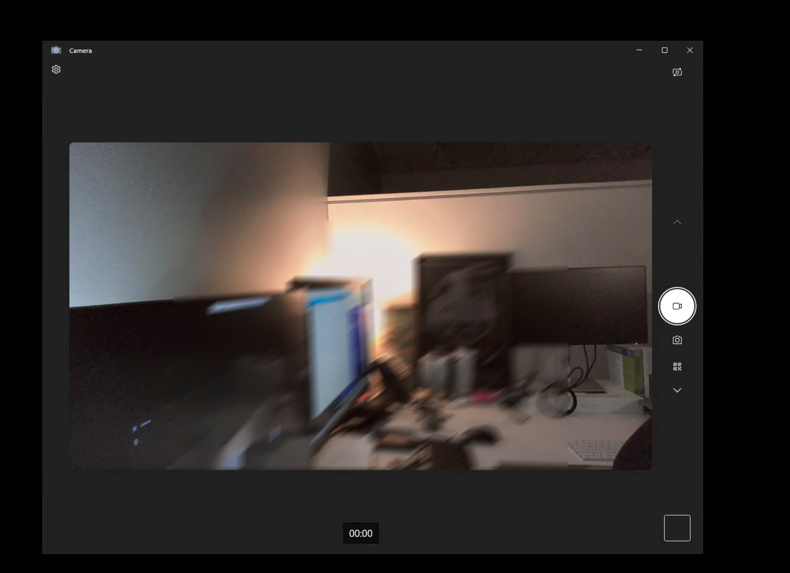

# Dev-Ops-09 Security Station Deployment & Operations Platform


### Platform Architecture Diagram



High-level architecture showing deployment automation, recovery workflows, validation processes, future observability integration, and Security Station lifecycle management.

## Project Status

Status:

✅ Complete

The Security Station Deployment & Operations Platform successfully achieved its primary objectives including:

- Workstation recovery validation
- Hyper-V virtualization validation
- Scanner validation
- Webcam validation
- DYMO printer validation
- RDP device-redirection validation
- Security Station deployment workflow standardization
- PowerShell deployment console development
- WinRM automation validation
- AutoAdminLogon validation
- SecurityStation-RDP validation
- LocalAccountTokenFilterPolicy baseline validation
- Remote Desktop trust-warning baseline validation

Future roadmap items represent planned enhancements and future platform evolution rather than unmet project requirements.

## Overview

The Security Station Deployment & Operations Platform is a workstation deployment, configuration management, recovery, and operations solution designed to support dedicated security workstation environments.

The project originated from a workstation recovery effort involving system imaging, virtualization, and recovery validation. Following successful validation of remote workstation functionality and peripheral redirection, the project evolved into a broader deployment and operations platform.

The platform focuses on:

- Standardized workstation deployment
- Configuration management
- Operational consistency
- Workstation recoverability
- Deployment automation
- Infrastructure as Code
- Endpoint observability
- Performance monitoring

---

## Documentation Notice

This repository contains a sanitized representation of a deployment and operations platform developed within a production environment.

All hostnames, IP addresses, usernames, credentials, organizational identifiers, asset information, and operational data have been removed or generalized for public publication.

---

## Portfolio Relationship

### Related Projects

#### Dev-Ops-02 Multi-OS Automation Platform

- Cross-platform automation
- Configuration management
- Ansible

#### Dev-Ops-06 Infrastructure Recovery Automation Platform

- Recovery workflows
- Operational resilience
- Recovery engineering

#### Dev-Ops-08 Backup & Data Protection Platform

- Backup architecture
- Recovery artifacts
- Data protection strategy

#### Dev-Ops-09 Security Station Deployment & Operations Platform

- Security workstation deployment
- Endpoint standardization
- Operations visibility
- Lifecycle automation

### Portfolio Progression

```text
Infrastructure Automation
        ↓
Infrastructure Recovery
        ↓
Backup & Data Protection
        ↓
Security Station Deployment & Operations
```

---

## Project Origin

The project began as a workstation recovery and validation initiative.

A production security workstation was recovered using Clonezilla imaging and converted into a reusable deployment platform.

Successful validation of:

- Scanner redirection
- Webcam redirection
- DYMO printer redirection
- RDP connectivity
- Security workstation workflows

demonstrated that a centralized workstation architecture was feasible.

The project subsequently evolved into a deployment and operations platform focused on standardization, automation, observability, and lifecycle management.

### Major Architectural Discovery

The project evolved into two distinct operational components.

#### Hosted Security Environment

A centralized environment responsible for:

- Security application hosting
- Peripheral integration
- Centralized management
- Remote desktop access

#### Security Station Endpoints

Dedicated workstations responsible for:

- User access
- Workstation standardization
- Security environment connectivity
- Consistent operator experience

This separation significantly reduced deployment complexity and established a path toward centralized workstation management.

---

## Objectives

### Primary Objectives

- Standardize security workstation deployments
- Reduce workstation configuration drift
- Improve recoverability
- Simplify workstation support
- Establish repeatable deployment procedures
- Improve deployment consistency

### Secondary Objectives

- Implement Infrastructure as Code practices
- Develop Ansible-based automation
- Automate workstation configuration
- Support future thin-client deployments
- Validate operational peripherals
- Improve operational visibility
- Deploy centralized monitoring
- Reduce support overhead
- Extend hardware lifecycle

---

## Current Project Status

### Phase

Operational Validation & Documentation Finalization

### Current Focus Areas

1. DOPS Validation

2. Security Station Deployment Console

3. Configuration Management Design

4. Proxmox Migration Planning

### Status

#### Completed

- Clonezilla Recovery
- Hyper-V Validation
- Scanner Validation
- Webcam Validation
- DYMO Validation
- RDP Validation
- Architecture Definition
- Deployment Workflow Definition
- GUI Development Started
- Deployment Console Development
- Deployment Console Validation
- WinRM Deployment Validation
- SecurityStation-RDP Validation
- AutoAdminLogon Validation
- Thin-Client Validation

#### In Progress

#### In Progress

- Documentation Finalization
- Screenshot Integration
- Repository Publication Review

#### Planned

- Ansible Configuration Framework
- Proxmox Migration
- Grafana Monitoring
- Automated Alerting

---

## Environment

---

## Deployment Strategy

The platform separates workstation onboarding from workstation configuration.

---

## Security Station Deployment Console

A PowerShell-based deployment console is currently under development.

### Current Features

- Hostname field
- Station selection dropdown
- Configuration preview
- Deployment status display
- Deploy button
- Exit button

### Future Features

- Configuration profile execution
- Deployment logging
- Validation reporting
- Profile management
- Monitoring integration

### Planned Workflow

User
    ↓
Select Station
    ↓
Deploy
    ↓
Apply Configuration Profile
    ↓
Validation
    ↓
Ready For Use

---

## Development Model

The project separates documentation development from automation development.
### Jumpbox Responsibilities

- Documentation
- Architecture
- Runbooks
- GUI Development
- Diagrams
- Portfolio Artifacts

### Automation Environment Responsibilities

- Ansible Development
- Playbooks
- Inventories
- Station Profiles
- Deployment Testing
- Configuration Management

This separation allows project documentation and design to progress independently of operational implementation.


---

### Onboarding Responsibilities

Existing onboarding automation is responsible for:

- Endpoint enrollment
- Domain enrollment
- Service management agent installation

### Configuration Management Responsibilities

Configuration management is responsible for:

- Remote desktop configuration
- Desktop standardization
- Power settings
- Startup configuration
- Validation checks
- Deployment logging

This separation significantly reduces deployment complexity and allows workstation onboarding and workstation configuration to evolve independently.

### Recovery Platform

- Clonezilla

### Validation Platform

- Microsoft Hyper-V
- Differencing Disks
- Generation 2 Virtual Machines

### Automation Platform

- PowerShell
- WinRM
- Ansible (Planned)

### Endpoint Management

- NinjaOne (Planned)

### Service Management

- Freshservice (Planned)

### Future Virtualization Platform

- Proxmox VE
- Proxmox Backup Server

---

## Technology Stack

### Recovery & Imaging

- Clonezilla
- VHDX Image Conversion
- Golden Image Management

### Virtualization

- Microsoft Hyper-V
- Differencing Disks
- Generation 2 Virtual Machines

### Implementation

- Golden Image Architecture
- Parent-Child VM Architecture
- Hyper-V Differencing Disks
- RDP Device Redirection
- Security Station Standardization
- Thin-Client Deployment Model

### Operating Systems

- Windows 10
- Windows 11
- Windows Server

### Automation

- PowerShell
- WinRM
- Ansible (Planned)

### Remote Access

- Remote Desktop Protocol (RDP)
- Device Redirection

### Peripheral Integration

Validated peripheral support through RDP device redirection:

- Barcode Scanners
- Logitech Webcam Devices
- DYMO LabelWriter Printers

Validation Status:

- Scanner Validation: PASS
- Webcam Validation: PASS
- DYMO Validation: PASS

### Monitoring & Observability

- Grafana (Planned)
- Prometheus (Planned)
- Windows Exporter (Planned)

### Endpoint Management

- NinjaOne (Planned)

### Service Management

- Freshservice (Planned)

### Future Virtualization Platform

- Proxmox VE
- Proxmox Templates
- Linked Clones
- Proxmox Backup Server

### Documentation

- Markdown
- Draw.io
- Git
- GitHub

### Deployment Interface

- PowerShell WinForms
- Security Station Deployment Console1~xx### Deployment Interface

- PowerShell WinForms
- Security Station Deployment Console

---

## Architecture

### Current Architecture

```text
Clonezilla Recovery
          │
          ▼
     WTS-Golden
          │
          ▼
   Hyper-V Parent
          │
          ▼
  Differencing Disks
          │
    ┌─────┼─────┐
    ▼     ▼     ▼

 WTS     WTS   WTS
Stations Stations Stations
          │
          ▼
      RDP Session
          │
 ┌────────┼────────┐
 ▼        ▼        ▼

Scanner Webcam  DYMO
```

### Future Architecture

```text
                Proxmox Template
                       │
                       ▼
                  Deploy Server
                       │
                       ▼
       Security Station Deployment Console
                       │
                       ▼
                    Ansible
                       │
                       ▼
              Station Configuration
                       │
                       ▼
                Production Station
                       │
          ┌────────────┴────────────┐
          ▼                         ▼

    NinjaOne                Windows Exporter
                                    │
                                    ▼
                               Prometheus
                                    │
                                    ▼
                                 Grafana
                                    │
                                    ▼
                           Dashboards & Alerts
```

```

---

## Implementation

### Completed

- Clonezilla recovery and restoration
- Hosted Security Environment validation
- Hyper-V virtualization validation
- Scanner redirection validation
- Webcam redirection validation
- DYMO printer redirection validation
- Remote Desktop validation
- Security workstation workflow validation
- Security Station architecture definition
- Deployment workflow definition
- Deployment Console development initiated

### In Progress

- Station standardization
- Hostname validation
- Configuration inventory collection
- Deployment planning

---

### Deployment Console

A PowerShell WinForms-based deployment console was developed to simplify workstation provisioning activities.

Current capabilities include:

- Hostname entry
- Security station selection
- Configuration preview generation
- Deployment status display
- Deployment queue preparation

The deployment console serves as the foundation for future automated workstation provisioning workflows.

Future enhancements include:

- Ansible execution
- Git repository integration
- Deployment logging
- Profile validation
- Deployment auditing

## Validation Results

### Infrastructure Validation

✅ Clonezilla Recovery

✅ Hyper-V Deployment

✅ Golden Image Creation

✅ Parent-Child Architecture

✅ Differencing Disks

✅ Network Validation

✅ DHCP Validation

### Peripheral Validation

✅ Barcode Scanner Validation

✅ Webcam Validation

✅ DYMO LabelWriter Validation

✅ RDP Device Redirection Validation

✅ Peripheral Workflow Validation

### Deployment Platform Validation

✅ Security Station Deployment Console Prototype

✅ Remote PowerShell Deployment

✅ WinRM Deployment Workflow

✅ Deployment Configuration Workflow

✅ Automated Reboot Workflow

### Authentication & Automation Validation

✅ WinRM Validation

✅ NTLM Authentication Validation

✅ Inventory Validation

✅ Vault Validation

✅ Windows Ansible Collections Validation

✅ ansible.windows.win_ping Validation

Result:

```text
pong
```

### Security Station Validation

✅ AutoAdminLogon Validation

✅ SecurityStation-RDP Task Validation

✅ Automatic mstsc.exe Launch Validation

✅ Reboot Validation

✅ No Technician Interaction Required

Assessment:

Production-candidate implementation validated.

### Platform Baseline Validation

✅ LocalAccountTokenFilterPolicy Validation

Registry:

```text
HKLM\SOFTWARE\Microsoft\Windows\CurrentVersion\Policies\System
```

Required Value:

```text
LocalAccountTokenFilterPolicy = 1
```

Outcome:

Successful enforcement restored NTLM authentication, WinRM management, and Ansible connectivity.

### RDP Trust Warning Baseline

✅ RedirectionWarningDialogVersion Validation

Registry:

```text
HKLM\SOFTWARE\Policies\Microsoft\Windows NT\Terminal Services\Client
```

Required Value:

```text
RedirectionWarningDialogVersion = 1
```

Outcome:

Successful suppression of Remote Desktop device-redirection trust warnings and support for automated workstation connection workflows.

Discovery:

Validation demonstrated that authentication and connectivity were functioning correctly. The remaining issue was a Remote Desktop trust-warning workflow that prevented fully automated session establishment.

The setting became part of the validated deployment baseline.

---

## Technical Challenges

### Remote Desktop Trust Warning Validation

A significant challenge during validation involved establishing a fully automated Remote Desktop workflow.

Initial troubleshooting focused on authentication, credentials, WinRM connectivity, DNS resolution, Remote Desktop configuration, and certificate-related trust behavior. Validation confirmed that connectivity and authentication were functioning correctly, but workstation connections still required user interaction before the session could be established.

Root-cause analysis identified a Remote Desktop trust-warning workflow associated with device redirection that interrupted automatic session establishment.

Resolution:

- Validated WinRM connectivity
- Validated NTLM authentication
- Validated DNS and FQDN-based connectivity
- Validated Remote Desktop configuration
- Identified Remote Desktop trust-warning behavior
- Implemented the required Windows policy configuration
- Added RedirectionWarningDialogVersion to the deployment baseline
- Revalidated automated workstation connectivity

Registry:

```text
HKLM\SOFTWARE\Policies\Microsoft\Windows NT\Terminal Services\Client
```

Required Value:

```text
RedirectionWarningDialogVersion = 1
```

Result:

✅ PASS

Outcome:

Validation confirmed that authentication and connectivity were functioning correctly. The remaining issue was a Remote Desktop trust-warning workflow. Incorporating the policy setting into the deployment baseline enabled fully automated workstation connectivity and improved technician experience.

### Webcam Validation

Webcam functionality was successfully validated through the Security Station architecture and Remote Desktop device redirection.

Validation included:

- Remote Desktop camera redirection
- Video capture device redirection
- Windows Camera application testing
- Logitech webcam detection
- Live video feed verification
- Security Station workflow validation

Result:

✅ PASS

Outcome:

Validation confirmed that webcam devices remain accessible through the Remote Desktop architecture and support operational workstation workflows.

### DYMO Printer Validation

DYMO LabelWriter functionality was validated through the Security Station architecture.

Validation included:

- Remote Desktop printer redirection
- Windows printer subsystem validation
- Printer availability verification
- Label printing workflow validation
- Security Station operational workflow testing

Result:

✅ PASS

Outcome:

Validation confirmed that DYMO LabelWriter devices remain available through the Security Station deployment architecture and support required operational workflows.

### Golden Image Management

Challenges included preserving a stable deployment baseline while supporting workstation recovery, virtualization, validation, and future deployment automation requirements.

Resolution:

- Clonezilla image preservation
- Golden image standardization
- Hyper-V parent image architecture
- Differencing disk strategy
- Controlled validation environment
- Repeatable recovery workflow

Result:

✅ PASS

Outcome:

A standardized golden-image approach reduced deployment complexity, improved validation consistency, and established a reusable foundation for future Security Station deployment automation.

---

---

## Current Status

### Completed

- Clonezilla Recovery
- Hosted Security Environment Validation
- Hyper-V Validation
- Scanner Validation
- Webcam Validation
- DYMO Validation
- Security Workflow Validation
- Deployment Workflow Definition
- Security Station Deployment Console Prototype
- WinRM Automation Validation
- Windows Inventory Validation
- Vault Validation
- NTLM Authentication Validation
- Windows Ansible Collections Validation
- ansible.windows.win_ping Validation
- AutoAdminLogon Validation
- SecurityStation-RDP Validation
- Automatic mstsc.exe Launch Validation

### Current Validation Scope

- Single Security Station validation model
- Controlled validation environment
- Incremental automation testing
- Deployment workflow validation

### Mandatory Platform Baseline

Registry:

```text
HKLM\SOFTWARE\Microsoft\Windows\CurrentVersion\Policies\System

```

Required Value:

```text
LocalAccountTokenFilterPolicy = 1
```

Status:

- WinRM Authentication Requirement
- GUI Enforcement Required
- Ansible Enforcement Required
- Validation Framework Enforcement Required

### Architectural Constraints

- WTS-116 remains the sole validation target
- WTS-Golden remains unchanged
- Parent image remains unchanged
- Multi-station deployment testing deferred
- Unique hostname automation required before multi-station deployment validation

### Current Phase

Security Station Validation Framework

Planned Validation Modules:

- LocalAccountTokenFilterPolicy
- WinRM Health
- AutoAdminLogon
- SecurityStation-RDP Task
- Printer Validation
- Camera Validation
- USB Validation
- Plug-and-Play Validation
- Service Validation
- Device Baseline Inventory

### Next Phase

- GUI Enforcement
- GUI Validation
- Ansible Enforcement
- Ansible Validation
- Security Station Validation Framework
- Dynamic RDP Profile Generation
- Vault Integration
- Desktop Lockdown Controls

---

---

## Observability Platform

Future development includes centralized workstation monitoring and operational visibility.

### Monitoring Architecture

```text
Security Stations
        │
        ▼
Windows Exporter
        │
        ▼
   Prometheus
        │
        ▼
    Grafana
        │
        ▼
 Dashboards & Alerts
```

### Planned Metrics

- CPU Utilization
- Memory Utilization
- Disk Utilization
- Network Usage
- Workstation Uptime
- RDP Session Monitoring
- Service Availability
- Deployment Health

---

## Future Roadmap

### Phase 1

### Security Station Validation Framework

Objectives:

- Validate LocalAccountTokenFilterPolicy
- Validate WinRM Health
- Validate AutoAdminLogon
- Validate SecurityStation-RDP Task
- Validate Printer Functionality
- Validate Camera Functionality
- Validate USB Devices
- Validate Plug-and-Play Devices
- Validate Required Services
- Establish Device Baseline Inventory

Status:

In Progress

---

### Phase 2

### Deployment Console Enhancements

Objectives:

- Enforce LocalAccountTokenFilterPolicy
- Validate deployment prerequisites
- Add deployment validation reporting
- Add deployment auditing
- Add deployment logging
- Integrate station definition profiles

Status:

In Progress

---

### Phase 3

### Identity Automation

Objectives:

- Automate hostname assignment
- Prevent inherited workstation identities
- Validate DNS registration
- Validate Active Directory computer objects
- Automate domain join workflows

Requirements:

- Unique hostname
- Unique DNS record
- Unique AD computer object
- Unique workstation identity

Status:

Planned

---

### Phase 4

### Ansible Integration

Objectives:

- Enforce workstation baselines
- Manage AutoAdminLogon
- Manage SecurityStation-RDP configuration
- Validate workstation configuration
- Generate deployment validation reports

Status:

In Progress

---

### Phase 5

### Technician Deployment Platform

Status:

Prototype Complete

Completed:

- Deployment GUI created
- Hostname assignment interface implemented
- Security Station selection implemented
- Configuration preview implemented
- Deployment status reporting implemented

Future Enhancements:

- Execute Ansible Playbooks
- Pull Configurations from Git Repository
- Deployment Logging
- Profile Validation
- Deployment Auditing

---

### Phase 6

### Observability Platform

Objectives:

- Deploy Windows Exporter
- Deploy Prometheus
- Deploy Grafana
- Create Security Station dashboards
- Establish performance baselines
- Implement proactive alerting

Metrics:

- CPU Utilization
- Memory Utilization
- Disk Utilization
- Network Utilization
- Service Health
- Workstation Availability

Status:

Planned

---

### Phase 7

### Proxmox Migration

Objectives:

- Convert validated Hyper-V architecture to Proxmox
- Create Security Station templates
- Implement linked-clone architecture
- Integrate with Proxmox Backup Server
- Maintain deployment transparency for Security Station users

Status:

Planned

---

### Phase 8

### Full Security Station Lifecycle Automation

Objectives:

- Automated Deployment
- Automated Configuration
- Automated Validation
- Automated Recovery
- Automated Monitoring

Target Outcome:

Reduce Security Station recovery time from approximately 2 hours to approximately 30 minutes while maintaining deployment consistency and operational visibility.

Status:

Planned

---

---

## Screenshots

### Security Station Deployment Console



Technician-facing deployment interface used to standardize workstation deployment and validation workflows.

### Configuration Preview Workflow



Configuration preview demonstrating station profile selection and deployment planning.

### Successful Deployment Validation



Successful deployment validation with deployment status reporting and technician feedback.

### Hyper-V Validation Environment



Hyper-V validation platform used to test workstation deployment and recovery workflows.

### Validation Workstation


Validation workstation used during deployment, peripheral, and operational testing.

### Thin-Client Validation Environment



Validation of the centralized thin-client architecture through automated Remote Desktop workflows.

### Webcam Redirection Validation



Validation of webcam functionality through the Security Station Remote Desktop architecture.

---

## Key Outcomes

- Recovered a production workstation image
- Created a reusable golden image
- Validated RDP-based workstation architecture
- Validated scanner compatibility
- Validated webcam compatibility
- Validated DYMO printer compatibility
- Established deployment standardization strategy
- Designed future automation architecture
- Defined observability platform roadmap
- Created foundation for endpoint lifecycle automation
- Developed technician-facing deployment console
- Simplified future workstation provisioning workflow
- Established foundation for deployment orchestration
- Established first Ansible-ready Security Station
- Validated WinRM remote management architecture
- Validated Ansible Vault integration workflow
- Validated NTLM authentication for Windows automation
- Successfully validated ansible.windows.win_ping connectivity
- Identified and documented LocalAccountTokenFilterPolicy as a mandatory platform baseline
- Validated SecurityStation-RDP automatic launch through Task Scheduler
- Established a repeatable Security Station deployment workflow
- Defined workstation identity management requirements for future deployments
- Established foundation for future Ansible-driven configuration management
- Established foundation for future Grafana-based observability and proactive monitoring
---

## Recovery Modernization Proof of Concept

Dev-Ops-09 is a proof of concept focused on modernizing Security Station recovery, deployment, and operational management through standardization, automation, and virtualization.

The goal is not to change existing security workflows. The objective is to preserve current operational requirements while improving recoverability, consistency, supportability, and long-term sustainability.

### Recovery Improvement

Current Recovery Process:

```text
~120 Minutes
```

Target Automated Recovery Process:

```text
~30 Minutes
```

Estimated Improvement:

```text
~90 Minutes Saved Per Incident
~75% Reduction In Recovery Time
```

### Operational Benefits

The platform is designed to provide:

- Standardized deployments
- Repeatable recovery workflows
- Reduced configuration drift
- Documented deployment procedures
- Version-controlled configuration management
- Simplified workstation support
- Consistent workstation configuration
- Improved recoverability
- Reduced dependency on undocumented workstation knowledge
- Improved knowledge transfer through documented and automated processes

### Hardware Lifecycle Benefits
The architecture also reduces dependence on specific workstation hardware, allowing organizations to adapt more easily to future endpoint changes while maintaining a consistent deployment process.

The solution supports longer workstation lifecycles through:

- Reduced workstation resource consumption
- Centralized and automated configuration management
- Reduced configuration complexity
- Reduced configuration drift
- Standardized deployment practices
- Simplified recovery procedures

By reducing unnecessary workload and local configuration overhead, workstation hardware can remain in service longer while maintaining a consistent operational experience.

### Future Hardware Readiness

The project also prepares for future hardware and platform changes, including:

- Non-removable storage
- Hardware-integrated devices
- Reduced hardware serviceability
- Vendor-specific recovery limitations

A standardized deployment platform reduces dependence on hardware-specific recovery methods and provides a more adaptable recovery strategy.

### Future Observability Platform

Future development includes:

- Windows Exporter
- Prometheus
- Grafana

The objective is to move from reactive support toward proactive operational management.

Future monitoring capabilities include:

- CPU utilization
- Memory utilization
- Disk utilization
- Storage performance
- Service health
- Application health
- Workstation availability
- Capacity trending
- Proactive alerting

This visibility helps identify performance or resource issues before they impact security operations.
The monitoring platform provides visibility into system health and enables proactive identification of performance constraints before they affect workstation availability or user operations.

### Long-Term Vision

The long-term vision is a complete Security Station lifecycle platform capable of:

```text
Deploy
    ↓
Configure
    ↓
Validate
    ↓
Monitor
    ↓
Maintain
    ↓
Recover
```

through a standardized, automated, and repeatable workflow.

The platform is intended to reduce recovery time, improve operational consistency, extend hardware lifespan, provide greater visibility into system health, and establish a foundation for future growth and automation.

## Lessons Learned

### Recovery Can Become a Platform

What began as a workstation recovery effort evolved into a reusable deployment and operations platform.

### Peripheral Validation Is Critical

Scanner, webcam, and printer compatibility represented the highest technical risk and required extensive validation.

### RDP Is More Capable Than Expected

RDP device redirection successfully supported security workstation workflows involving scanners, webcams, and printers.

### Golden Images Improve Consistency

A validated golden image significantly reduces deployment complexity and improves workstation consistency.

### Virtualization Accelerates Validation

Hyper-V enabled rapid testing, repeatability, and experimentation without impacting physical endpoints.

### Observability Should Be Built In

Monitoring and operational visibility are now considered core platform requirements rather than future add-ons.

### Infrastructure as Code Applies to Endpoints

Configuration management principles commonly used for servers can also be applied to workstation deployment and lifecycle management.

### Thin-Client Architecture Is Viable

Validation demonstrated that security workstation functionality can operate through a centralized RDP-based architecture while preserving required business workflows.

### Technician-Focused Automation Improves Adoption

Automation is more effective when operational staff are provided with simple interfaces that abstract deployment complexity.

The Security Station Deployment Console demonstrates how Infrastructure as Code workflows can be exposed through a technician-friendly interface while preserving deployment consistency and standardization.

### Baseline Configuration Matters

Validation identified several Windows configuration settings that became mandatory platform baselines.

Key discoveries included:

- LocalAccountTokenFilterPolicy
- Remote Desktop trust-warning suppression
- Consistent remote-management configuration

These settings were incorporated into the deployment process to improve deployment consistency and reduce post-deployment troubleshooting.

### Authentication and Trust Are Different Problems

A major lesson learned during validation was that authentication success does not necessarily guarantee a seamless user experience.

Initial troubleshooting focused on credentials and authentication workflows. Validation ultimately demonstrated that authentication was functioning correctly while a separate Remote Desktop trust-warning workflow was preventing fully automated connections.

Resolving the trust workflow significantly improved automation and user experience.

### FQDN-Based Connectivity Improves Reliability

The final deployment design standardized on Fully Qualified Domain Names (FQDNs) rather than short hostnames or static IP addresses.

Benefits include:

- Improved DNS reliability
- Reduced dependency on legacy name-resolution methods
- Better alignment with Active Directory environments
- Improved scalability
- Simplified workstation replacement and recovery

Validation confirmed that FQDN-based targeting provided a more consistent and maintainable deployment model.

### Operational Validation Is As Important As Automation

Many of the final deployment improvements were discovered through repeated real-world validation rather than initial design assumptions.

Examples include:

- Auto-login validation
- Remote Desktop trust validation
- Scheduled task validation
- Device-redirection validation
- RDP profile optimization
- Recovery workflow testing

These findings reinforced the importance of validating deployment architecture under realistic operational conditions.
`

### Continuous Learning Improves Engineering Outcomes

One of the most valuable lessons from this project was that continuous learning often drives better architecture than initial assumptions.

What began as a workstation recovery effort evolved into a deployment, validation, and operations platform through ongoing testing, research, documentation, and validation activities.

Key improvements emerged from iterative learning and real-world validation, including:

- Hosted Security Environment architecture
- Security Station endpoint standardization
- FQDN-based connectivity
- LocalAccountTokenFilterPolicy baseline enforcement
- Remote Desktop trust-warning baseline enforcement
- Deployment console development
- Validation framework design
- Future observability planning

The project reinforced that successful engineering is a continuous process of learning, validating, documenting, and improving rather than a single implementation effort.

Future enhancements, including Grafana-based observability, expanded Ansible automation, and Proxmox-based deployment workflows, will continue to build upon the foundation established during this project.


